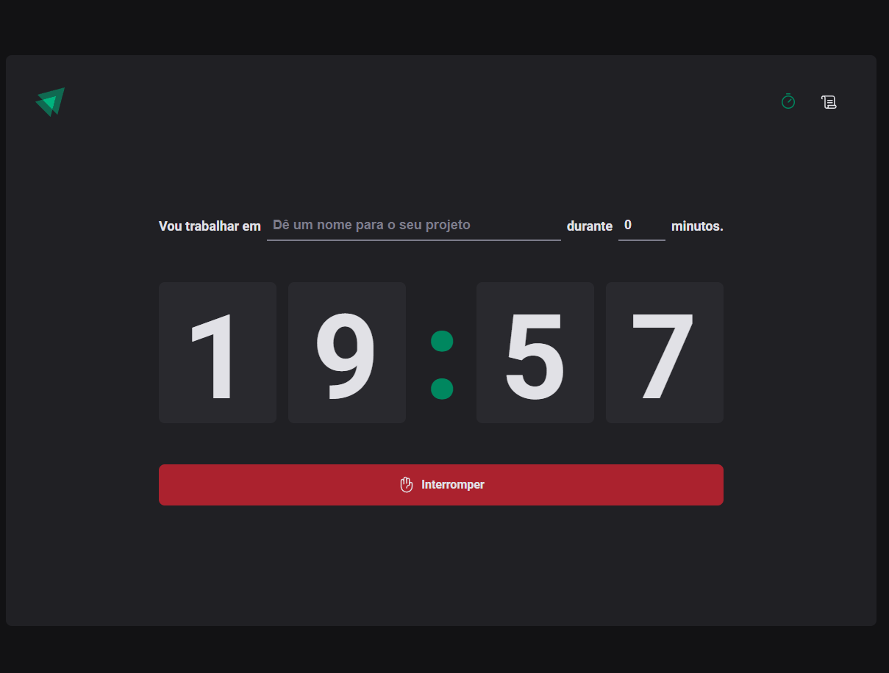

<h1 align="center">
  Ignite Timer
</h1>

  <a href="#-layout">Layout</a>&nbsp;&nbsp;&nbsp;|&nbsp;&nbsp;&nbsp;
  <a href="#-projeto">Projeto</a>&nbsp;&nbsp;&nbsp;|&nbsp;&nbsp;&nbsp;
  <a href="#-tecnologias">Tecnologias</a>&nbsp;&nbsp;&nbsp;|&nbsp;&nbsp;&nbsp;    
  <a href="#memo-licença">Licença</a>

 

  

## 💻 Projeto

O Ignite Timer é uma aplicação de pomodoro que permite criar tarefas e definir um tempo para se concentrar nelas. Além disso, a aplicação possui uma seção de histórico que mostra todas as tarefas já concluídas, juntamente com seus respectivos status.

Este projeto foi desenvolvido no módulo "Criando SPAs" da trilha de ReactJS do curso Ignite da Rocketseat. O objetivo principal foi construir uma aplicação completa, incorporando conceitos importantes do ecossistema React, como ContextAPI, useReducer, immer, styled-components e muito mais.

## 🚀 Tecnologias

Esse projeto foi desenvolvido com as seguintes tecnologias:

- Reactjs
- Vite
- Typescript
- ContextApi
- Styled Components
- Immer
- Reducer

## :memo: Licença

Esse projeto está sob a licença MIT. Veja o arquivo [LICENSE](LICENSE.md) para mais detalhes.

---
